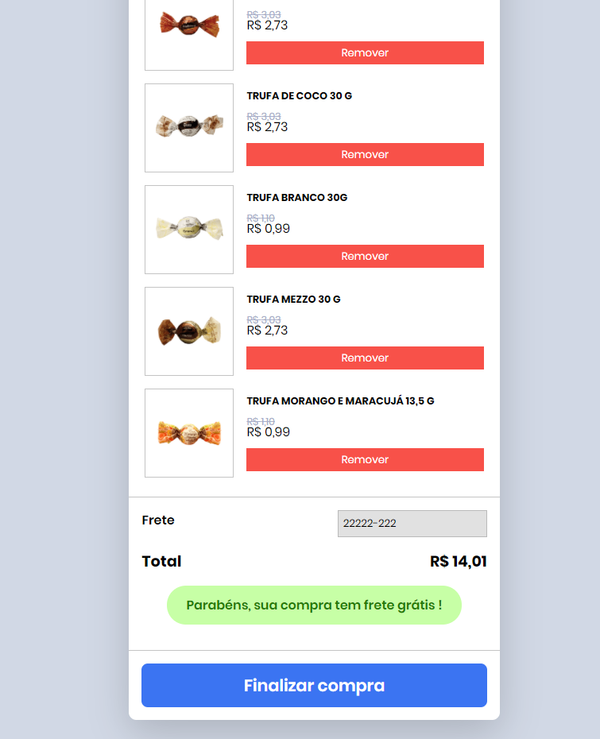

# Codeby - Teste Carrinho

## 📋 Instruções
```
# instalar as dependências
yarn

# iniciar o projeto
yarn start
```

Se tudo correu certo a aplicação já irar abrir no neu navegador padrão. Na home já terá um menu para cadá parte do teste.

## :cherries: Implementações a mais
* Remover produtos do carrinho;
* Introduzir CEP  - será calculado o frete (modalidade e valor - ambos são fixos) e verificar se tem direito a frete grátis.


